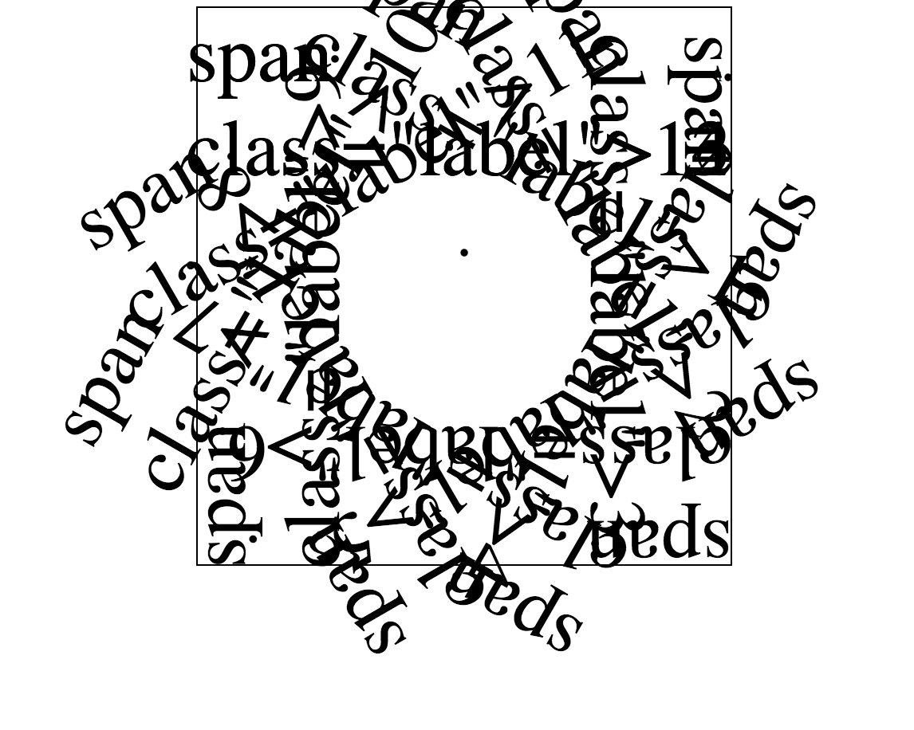
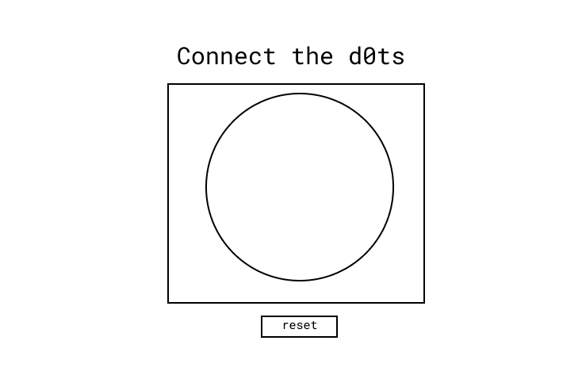
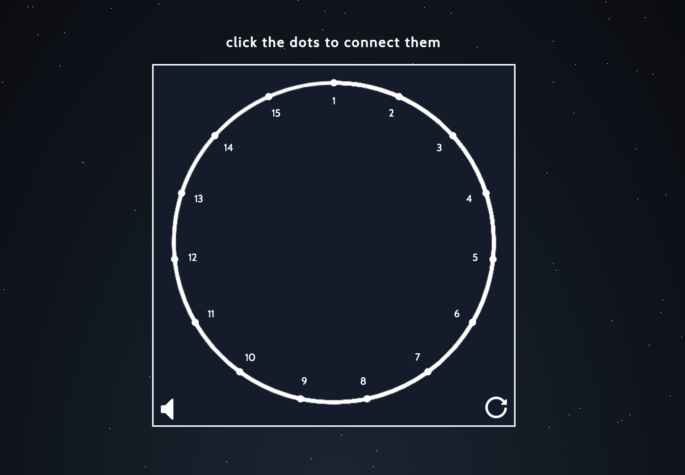

# Dot ⚫
No clue how we got here, but it was a blast!

## Background

As part of the application process for Dormroom Fund HQ, applicants are tasked with making a circle in the most creative way possible. 

## Brainstorming

My first thought was to build the <em>simplest</em> way possible. My general philosophy in application develop is to reduce complexity in building blocks. There will always be plenty of ways to show off creativity, but typically the building blocks are not the place! However, for this program, the circle is the entire project, so we had to get funky.

I first turned to [neal.fun](http://neil.fun) for ideas. I've seen some of his incredible projects on Twitter, and thought he might have something for inspiration.

I thought [macaroni art](https://macaroni-art.glitch.me/) and his [make a constellation](https://make-a-constellation.glitch.me/) projects were cool. The latter reminded me off a "connect the dots" sort of game, and I vibed with the idea. I thought it would be cool to re-create my childhood restaurant experiences of connecting the dots.

## My take: How to Build a Circle

My most creative way to get a circle to appear is make the user draw it.

I debated a few options, including:
 - printing the word "circle" on the screen
 - pointing to a Wikipedia page on circles
 - Pixel-by-pixel color flips to arrange a circle

 In the end, I thought more critically about the purpose of this project. It is to highlight creativity, fun, and engineering talent as part of an application, so I settled for a canvas-based connect the dots method!

 Plus, a little more experience with using HTML Canvas would probably come in handy.

## Development

(10 minutes in)

### Making dots

I constructed the "dots" by taking an image of dot, adding a bunch of padding below, and rotating each dot to form a full circle. This part took me the most time, as I had to play around with various padding and translation to get it just right.

### Picking Framework

I initially developed Dot in vanilla HTML/CSS/JS, but quickly realized it would be more efficient to build it in React. The ability to deal with components instead of blocks of HTMl/JS became a dealbreaker.

(fun fact: I accidently deleted my code when copying my React boilerplate in, but had a saved version on Repl.it!!)

### Adding the Circle

To generate the circle, I considered the ability to actually "draw" on the screen, but didn't want to validate the start and end points for every line the user could draw. Following Neal's example from the constellation, I opted for point-click and automatic lines.

Using a canvas, I set the start point for the first dot, and increased the total rotation of the circle each time the user connected the next dot.

Aligning the canvas lines and the dots took a lot of trial-and-error, but I finally succeeded in getting the math right for positioning and adding new segements.

### Making it Pretty

It this point, the functionality was complete. A user could click on dots to connect them, and the program would draw circles along the way.

However, it looked similar to the sketch below:

It was simplistic, but not engaging whatsoever. After about 4/15 "clicks" to connect the dots, it was no longer fun.

#### Click-for-dopamine

My design philosophy was to create an experience that encourages the user to click more. Inspired by learning from my design class, each click should release dopamine to keep users engaged! (Also see: [Hooked by Nir Eyal]()).

Next steps:

1. Enlarge each dot when users hover (encourage to click)
2. Fun animation when clicked (encourages users to keep clicking)
3. Celebration at the end (encourages users to feel satisfied when complete)
4. Set the mood (develop an emotional response)

The last step was the trickiest, but I opted for a constellation-type vibe to give tribute to my inspiration. I wanted to re-create a "starry night" theme, and set a cool, relaxed environment.

I tested various color schemes, and stumbled upon a [beautiful starry night CSS background library](https://codepen.io/saransh/pen/BKJun). Around the same time, I had a friend who reminded me about "The Circle of Life" from Lion King, so I dropped a MP3 play button for a full experience!

## Conclusion

Final product:

### Next Steps
For the Socket.IO portion, I could have added the ability to "remember state" and how many dots were drawn (this is saved in React State). However, building out this feature was beyond my time allocation, and I was happy with the overall look and feel of the project!

## Thanks to...

- [Neal Agarwal](https://nealagarwal.me/) for the theme inspiration
- [Linus Lee](https://www.ocf.berkeley.edu/~linuslee/) for telling me about DRF
- [Saransh Sinha](https://codepen.io/saransh/pen/BKJun) for the incredible starry night background
- [Mo.js](https://github.com/mojs/mojs) for the snazzy click animations
- And the DRF team for a fun project!